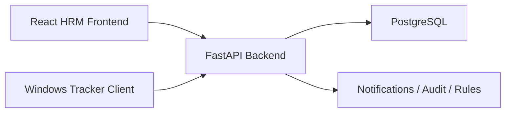

# HRM System Architecture

## 1. Overall architecture

The project is designed as a monorepo with three primary applications:

1. `frontend`
   React.js web application for Super Admin, Admin, HR, TL, and Employee users.
2. `backend`
   FastAPI service exposing secure REST APIs, JWT authentication, permission enforcement, and business modules.
3. `tracker-client`
   Python-based Windows background agent installed on employee systems for device registration, session tracking, idle tracking, heartbeat sync, and offline cache replay.

## 2. High-level flow



## 3. Role hierarchy

The exact role order is:

1. Super Admin
2. Admin
3. HR
4. TL
5. Employee

Rules:

- Super Admin always has full system access.
- No other role inherits full access by default.
- All non-Super-Admin access is configured from Super Admin Settings.
- Backend permission checks are the source of truth.
- Frontend visibility mirrors backend permissions but does not replace them.

## 4. Permission system design

### Permission model

Permissions are catalog-driven and stored in the database. Each permission record contains:

- `key`: unique machine key such as `employees.create`
- `module`: dashboard, employees, attendance, leave, payroll, reports, settings, tracker, users, notifications
- `category`: module, menu, page, action, approval, correction, export, setting
- `resource`: functional target such as employee, attendance_summary, payslip
- `action`: access, view, create, edit, delete, approve, export, manage
- `description`

### Mapping tables

- `roles`
- `permissions`
- `role_permissions`
- `user_permissions`

`role_permissions` provides the baseline access by role. `user_permissions` supports targeted overrides when needed. Effective permissions are computed as:

1. if role is `Super Admin`, allow all
2. load allowed role permissions
3. apply user-level overrides
4. return the final allow set

### Why this is scalable

- menus can be driven by `menu.*` permissions
- page visibility can be driven by `page.*` permissions
- actions can be driven by fine-grained permissions such as `attendance.correct`
- backend dependencies can enforce the same keys used by frontend rendering

## 5. Database design

### Auth

- `roles`
- `permissions`
- `role_permissions`
- `user_permissions`
- `users`
- `user_sessions`

### Employee

- `departments`
- `designations`
- `employees`
- `reporting_managers`

### Attendance

- `attendance_rules`
- `attendance_logs`
- `attendance_daily_summary`
- `attendance_corrections`
- `attendance_audit_logs`

### Leave

- `leave_types`
- `leave_requests`
- `leave_balances`
- `leave_approvals`

### Payroll

- `salary_structures`
- `payroll_runs`
- `payslips`

### Tracker

- `devices`
- `tracker_sessions`
- `tracker_idle_logs`
- `tracker_heartbeats`

### Utility

- `notifications`
- `app_settings`
- `holidays`
- `audit_logs`

### Important relational notes

- `users.role_id -> roles.id`
- `employees.user_id -> users.id`
- `role_permissions.role_id -> roles.id`
- `role_permissions.permission_id -> permissions.id`
- `user_permissions.user_id -> users.id`
- `user_permissions.permission_id -> permissions.id`
- `attendance_logs.employee_id -> employees.id`
- `leave_requests.employee_id -> employees.id`
- `salary_structures.employee_id -> employees.id`
- `devices.employee_id -> employees.id`
- `tracker_sessions.device_id -> devices.id`

### Core indexing strategy

- unique indexes on `roles.code`, `permissions.key`, `users.email`, `employees.employee_code`, `devices.device_uuid`
- composite indexes on attendance dates, leave date ranges, tracker heartbeats, payroll periods
- soft-delete and status-aware filtering on business entities

## 6. Backend folder structure

```text
backend/
  app/
    main.py
    api/
      deps.py
      router.py
      v1/endpoints/
        auth.py
        settings.py
    core/
      config.py
      constants.py
      security.py
    db/
      base.py
      session.py
    models/
    permissions/
      catalog.py
    schemas/
    services/
    middleware/
    utils/
  alembic/
```

### Backend principles

- FastAPI routers remain thin
- services hold business logic
- Pydantic schemas define contracts
- SQLAlchemy models define persistence
- dependencies enforce authentication and permissions
- Alembic owns schema migration history

## 7. Frontend folder structure

```text
frontend/
  src/
    api/
    components/
      common/
      layout/
    hooks/
    layouts/
    pages/
      auth/
      dashboard/
      settings/
    permissions/
    routes/
    store/
    utils/
```

### Frontend principles

- protected routes validate both authentication and permission
- dynamic sidebar/menu is permission-driven
- reusable API client handles auth headers and token refresh
- pages remain thin and delegate data loading to service modules

## 8. Super Admin settings design

Only Super Admin can open the settings module.

### Main sections

1. role overview
2. permission matrix
3. menu/page visibility controls
4. action permissions
5. app settings

### Initial implemented APIs

- list roles
- list permission catalog
- get effective permissions by role
- update role permissions
- list app settings
- upsert app settings

### Enforcement model

- frontend hides menus and actions if permission is missing
- backend rejects any unauthorized request even if manually called

## 9. Backend API structure

### Authentication

- `POST /api/v1/auth/login`
- `POST /api/v1/auth/refresh`
- `POST /api/v1/auth/logout`
- `GET /api/v1/auth/me`

### Super Admin settings

- `GET /api/v1/settings/roles`
- `GET /api/v1/settings/permissions/catalog`
- `GET /api/v1/settings/roles/{role_id}/permissions`
- `PUT /api/v1/settings/roles/{role_id}/permissions`
- `GET /api/v1/settings/app-settings`
- `PUT /api/v1/settings/app-settings`

### Planned next module groups

- employees
- attendance
- leave
- dashboard/reports
- payroll
- tracker admin APIs

## 10. Frontend pages

Implemented or scaffolded pages:

- login
- role-aware dashboard
- Super Admin settings
- attendance placeholder
- employee management placeholder
- leave management placeholder
- payroll placeholder
- reports placeholder
- notifications placeholder
- tracker monitoring placeholder

## 11. Tracker client technical design

### Responsibilities

- auto-start on Windows login using Task Scheduler
- register the device if needed
- create a tracker session on login/start
- monitor idle transitions
- emit periodic heartbeat events
- close session on shutdown/logoff when possible
- cache unsent payloads locally
- replay cached payloads when connectivity returns

### Tracker modules

- `api/`: authenticated HTTP client
- `services/device_service.py`: registration and device identity
- `services/session_service.py`: session lifecycle
- `services/idle_service.py`: idle detection
- `services/heartbeat_service.py`: background sync loop
- `utils/cache.py`: offline queue
- `startup/`: startup registration scripts and notes

### Recommended startup strategy

Use Windows Task Scheduler instead of a fragile startup shortcut. Create a scheduled task that:

- runs at user logon
- restarts on failure
- runs with the current user context
- points to the packaged tracker executable or Python entry point

## 12. Implementation order

1. project scaffolding
2. schema and permission model
3. backend foundation
4. frontend foundation
5. authentication module
6. Super Admin settings and permission engine
7. employee management
8. attendance
9. leave management
10. dashboard and reports
11. payroll
12. tracker client and sync APIs
13. tracker monitoring UI
14. final hardening and testing
